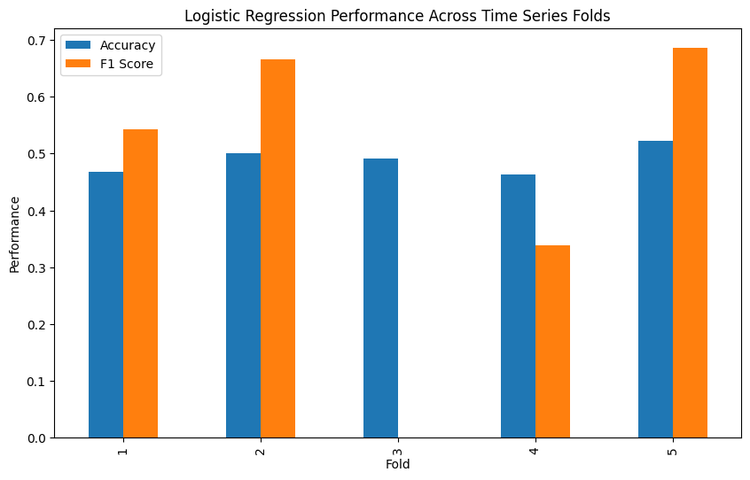

# Stock-Direction-Predictor
### Notebook link - https://github.com/timeless81/Stock-Direction-Predictor-Final/blob/main/Stocks%20Final%20.ipynb
### *"This product uses the FRED® API but is not endorsed or certified by the Federal Reserve Bank of St. Louis."

## Overview
The intent of this project is to predict the direction of movement of the stock price based historical trends on several different factors like momentum, lag, technical indicators etc. Based ont the stock movement direction the user of this ML system can take automatic bets if the ratio of success/failure is somewhat skewed. A 60:40 ratio would be a great winner. 
The predication would not be for the exact price of the stock in future but it would be regarding the trend that whether the price is going to go up or down in near future.

The stock markets are inherently volatile and it is influence by several factors, therefore making the accurate predictions challenging. This project aim to achieve the following – 

•  Build a machine learning model that predicts whether a stock’s price will increase or decrease next day.
•  Leverage historical price data and derived technical indicators.
•  Provide a data-driven approach to assist trading decisions.

## Model Outcomes:

The problem is framed as a classification task:
Output
1 -> Stock price will go up.  
0 -> Stock price will go down.  
It is a supervised learning since the model is trained on labeled historical data.   

## Data Acquisition: 
The data required would be the stock ticker price movement from yahoo finance. The dataset consists of historical stock market data, typically including:   
•	Open, High, Low, Close prices.  
•	Volume.   
•	Date index.   
Library – yfinance.    
Ticker – AAPL. Apple Inc.’s stock has been used for this project.    
Visualizations - Following visualizations are used in this project.  
•	Time series plots of stock prices.   
•	Moving averages (MA20, MA50) overlaid on price.   
•	Distribution of target variable (up vs down).   

These visualizations help confirm that:    
•	Trends exist.  
•	There is enough variability for learning.   
•	The dataset is suitable for prediction.   

## Data Preparation
1. Handling missing values: removed using dropna.   
2. Check for outliers - using z score, no outliers were found for AAPL stock in last 6 years.    

3.	Test train split – Chronologically split the data.    
Training set – earlier data.   
Test set – later data.   
A 80:20 split it done meaning – 80% - Training and 20% - Testing. This avoids data leakage from future information.  
4.	Feature engineering and encoding - Created a number of derived features –

### 1. Price based features
OHLC - Open, High, Low, Close.  
Prive 20 day moving average.  
Price 50 day moving average.  
Price 200 day moving average.   

### 2. Volume based features
Volume spike.  
Volume moving average.

### 3. Indices movement - reflects broader market movements NASDAQ & S&P movement

### 4. Technical indicators
a. RSI - Relative Strength Index  
b. Bollinger Band - They consist of three lines plotted on a stock chart:   
    Middle band → a moving average (usually 20-day).   
    Upper band → middle band + volatility (standard deviation).  
    Lower band → middle band − volatility.  

### 5. Lag features 
Past 1 day return.   
Past 2 day return.  

### 5. Seasonality
Day of the week.    
Month of the year. 

### 6. Market sentiments
Twitter analysis.  
Reddit analysis.  
News analysis.  

### 7. Macroeconomics
Interest rate.   
Gold price.  
Bitcoin price.  

Target Variable - add a target variable:
•	If next day price > current → 1
•	Else → 0
•  Normalized or scaled features for some other indicators like gold or bitcoin price:

## Modelling:
The following machine learning algorithms are used:
Logistic Regression: 
•	Base model
•	Fast
Random Forest Classifier
•	Captures non linear relationships
K Nearest Neighbors (KNN):
State Vector Machines (SVC)

We calcualted the accurary score, f1 score and runtime for these models. 

Random form classifier was also used to check the importance of different features.

# Model Evaluation:
Cross validation of the models was done and the accuracy, f1 score and runtime of the models was recorded.
### Evaluation Metrics – 
•	F1 score - primary.  
•	Accuracy - secondary.  

Stock data is sensitive to the false prediction either false positive or false negative. Precision suggests that when the model says “stock will go up", how often is it correct Recall suggests that Out of all actual stock up days, how many did the model catch? Since both the precision and recall have to be balanced so F1 score is chosen as the evaluation metric, requiring both of them to be high.   
      F1 score = 2 * (precision*recall)/(precision + recall).  
Why accuracy is not the main evaluation metric - It is because the accuracy suggest the overall correctness. In stock prediction, precision reflects the quality of buy signals, while recall captures the ability to identify profitable opportunities.

## Model Selection

### Base Model -
Logistical regression was used as the base model for this due to its efficiency in binary classification problems. It becomes a model to compare other models.   
Various classification models were compared -     
•	Compared models based on performance on the test set.   
•	The best model was selected based on highest F1 score.   
Typical outcome    
•	Logistic Regression → good baseline.   
•	Random Forest → improved performance due to capturing nonlinear patterns with about 93% f1 score.    

### Cross validation of logistic regression was done - 

### Model Tuning
Models were tuned based on the GridSearchCV hyperparameter explorations.   
Based on the tuned modesl the random forest classifier still emerged as the best in terms of f1 score and accuracy scores.  

# Conclusions
This project demonstrates that machine learning models can identify patterns in historical stock data to predict price direction. While results may not guarantee profitability due to market unpredictability, the approach provides a strong foundation for:    
•	Algorithmic trading.    
•	Financial forecasting.   
•	Further model improvements (using deep learning etc.).   

# Future work
Although the modeling is able to predict nearly 90% accuracy, but it doesn't have high value idea for predicting the stock direction and it may not be sufficient to follow the modeling to make successful trades. 

The suggested items to improve on this model is to do the following to make it more actionable and successful.
1. Change the target from stock direction to qualified signals of 'buy', 'sell' or 'hold'.
2. Qualify the strategy by running it over different stock at different points in time.
3. Quantify the efficiency of the model to generate the profit for the user of this ML model.

