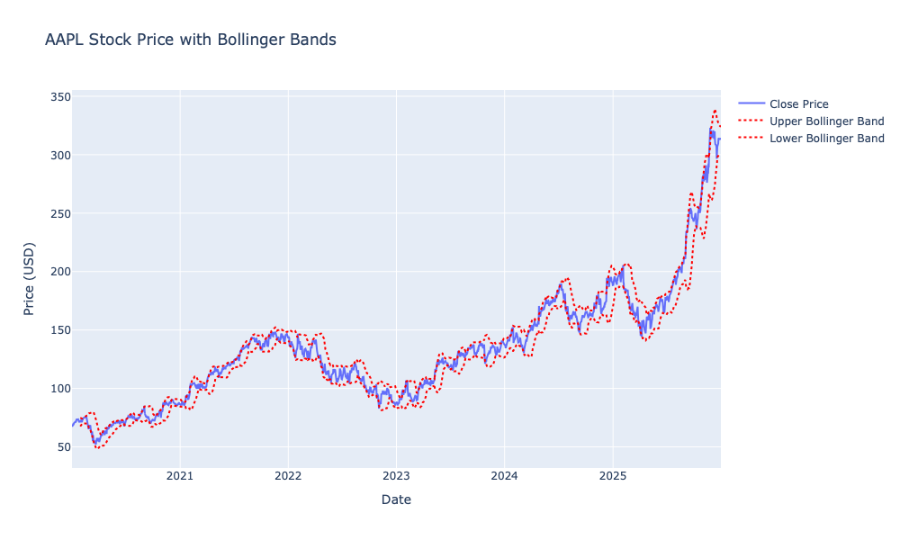
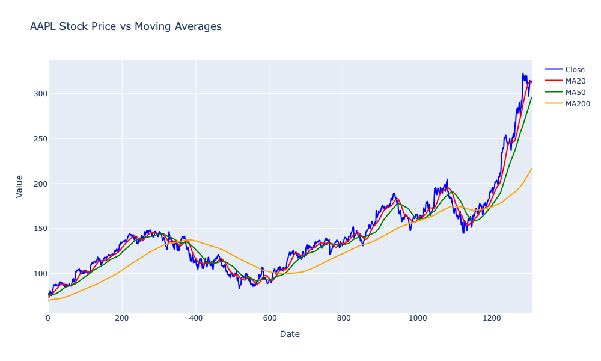
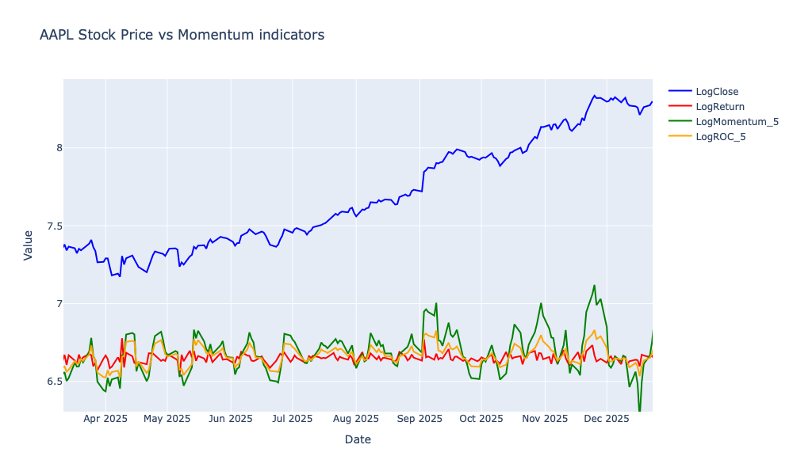

# Stock-Direction-Predictor
### Notebook link - https://github.com/timeless81/Stock-Direction-Predictor/blob/main/Stocks.ipynb

### *"This product uses the FRED® API but is not endorsed or certified by the Federal Reserve Bank of St. Louis."

## Key Featurs
### 1. Price based features
OHLC - Open, High, Low, Close.  
Prive 20 day moving average.  
Price 50 day moving average.  
Price 2000 day moving average.   

### 2. Volume based features
Volume spike.  
Volume moving average.  

### 3. Indices movement - reflects broader market movements
NASDAQ & S&P movement

### 4. Technical indicators
a. RSI - Relative Strength Index  
b. Bollinger Band - They consist of three lines plotted on a stock chart:   
    Middle band → a moving average (usually 20-day).   
    Upper band → middle band + volatility (standard deviation).  
    Lower band → middle band − volatility.  
Momentum.  

### 5. Lag features 
Past 1 day return.   
Past 2 day return.  

### 5. Seasonality
Day of the week.    
Month of the year. 

### 6. Market sentiments
Twitter analysis.  
Reddit analysis.  
News analysis.  

### 7. Macroeconomics
Interest rate.   
Gold price.  
Bitcoin price.  
Fed decisions.  

### EDA (Exploratory Data Analysis)

#### Boolinger Band 

### Price vs moving averages
Plotted with moving average of 20, 50 and 200 days. 

### Price vs momentum indicators
The growing spike amplitudes on the momentum indiactos is a good reflection of upwards trending closing price

### The setup 
The main setup is that if put your money in this stock from this date then how much will it be by that date
or will the stock go up or down by this amount of percent.

