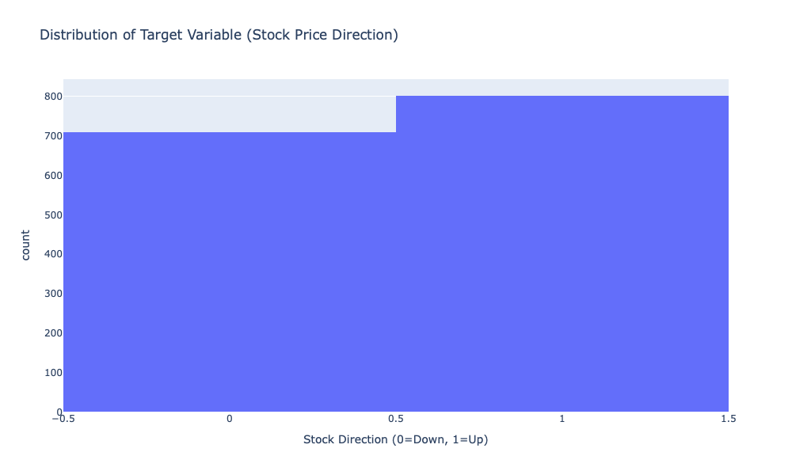
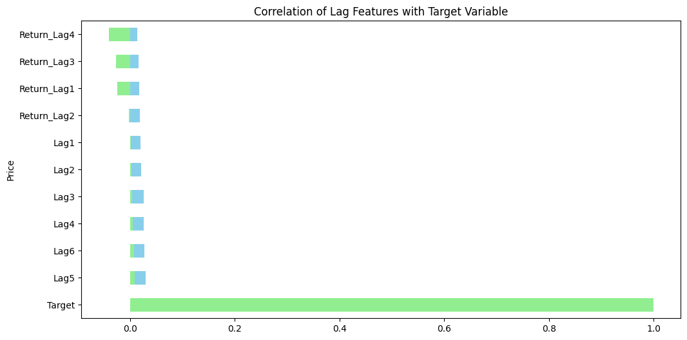
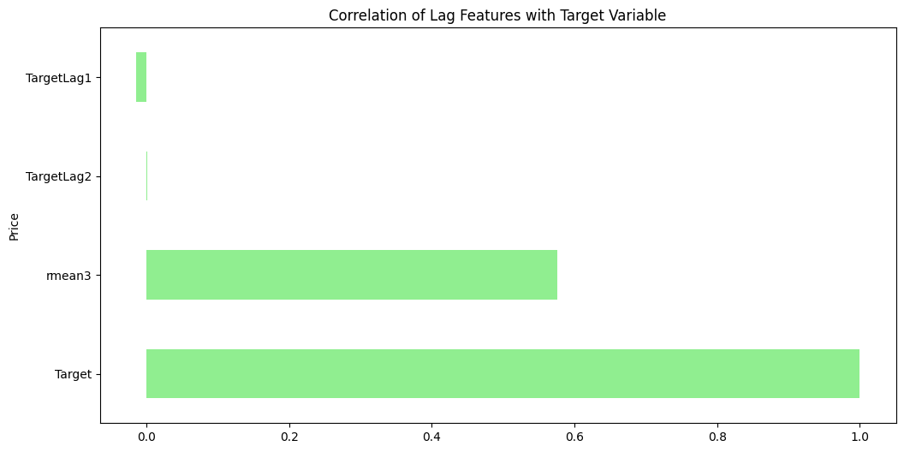

# Stock-Direction-Predictor
### Notebook link - https://github.com/timeless81/Stock-Direction-Predictor/blob/main/Stocks.ipynb

### *"This product uses the FRED® API but is not endorsed or certified by the Federal Reserve Bank of St. Louis."

## Overview
The intent of this project is to predict the direction of movement of the stock price based on several different factors like momentum, lag, technical indicators etc. 
Based ont the stock movement direction the user of this ML system can take automatic bets if the ratio of success/failure is somewhat skewed. A 60:40 ratio would be a great winner.

## Key Features
### 1. Price based features
OHLC - Open, High, Low, Close.  
Prive 20 day moving average.  
Price 50 day moving average.  
Price 2000 day moving average.   

### 2. Volume based features
Volume spike.  
Volume moving average.  

### 3. Indices movement - reflects broader market movements
NASDAQ & S&P movement

### 4. Technical indicators
a. RSI - Relative Strength Index  
b. Bollinger Band - They consist of three lines plotted on a stock chart:   
    Middle band → a moving average (usually 20-day).   
    Upper band → middle band + volatility (standard deviation).  
    Lower band → middle band − volatility.  
Momentum.  

### 5. Lag features 
Past 1 day return.   
Past 2 day return.  

### 5. Seasonality
Day of the week.    
Month of the year. 

### 6. Market sentiments
Twitter analysis.  
Reddit analysis.  
News analysis.  

### 7. Macroeconomics
Interest rate.   
Gold price.  
Bitcoin price.  
Fed decisions.  

### EDA (Exploratory Data Analysis)

#### Boolinger Band 

### Price vs moving averages
Plotted with moving average of 20, 50 and 200 days. 

### Price vs momentum indicators
The growing spike amplitudes on the momentum indiactos is a good reflection of upwards trending closing price

### The setup 
The main setup is that when you start from this date and by this date how much money will you have or by how much will the stocks up or down.

## EDA Observations:

### 1. The stock direction:

From the above plot it is apparent that stock moves up about 53% of time and down for 47% of the time. Which is close to a 50:50 split and therefore the prediction of the stock direction(Target) is not going to be simple modeling.

### 2. Lag features do not correlate well with the target. Here is the correlation plot

This happens because the linear correlation between those features is missing.

However, doing a rolling mean average of the target resulted in a good correlation.

### Explaination - Why target lags correlation with Target is small
